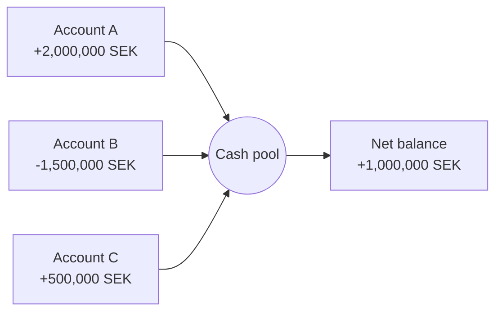

# cash-pooling-simulator
Just for fun :)

A small project exploring how a **cash pool** affects interest costs
and income for a company with several bank accounts.

##  The idea

Companies often have some accounts in overdraft while others hold
surplus cash. A cash pool nets the balances, so interest is paid on
the net position instead of on each account separately.

##  Example (fictional numbers)

Assumed rates: 1% on deposits, 6% on overdrafts.

| Account | Balance (SEK) | Without pool (SEK/year) | With pool (SEK/year) |
|---------|--------------:|------------------------:|---------------------:|
| A       | +2,000,000    | +20,000                 | –                    |
| B       | -1,500,000    | -90,000                 | –                    |
| C       | +500,000      | +5,000                  | –                    |
| **Net** | **+1,000,000**| **-65,000**             | **+10,000**          |

**Result: the company improves its yearly result by 75,000 SEK.**

##  Roadmap

- [x] Describe the concept
- [x] Calculate a simple example
- [ ] Python simulation with daily balances
- [ ] Different interest rates per account
- [ ] Compare physical vs. notional pooling

##  Author

Simon Thorsell, Economics student at Uppsala University
